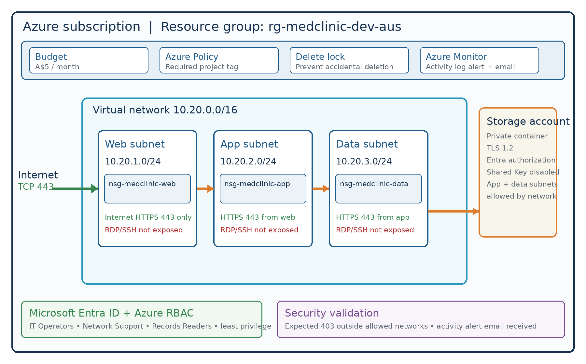

# Secure Medical Clinic Azure Environment

Security-focused Microsoft Azure portfolio project demonstrating network segmentation, identity and access management, secure storage, monitoring, governance, and cost control using fictitious medical data only.

## Project overview

This project implements a low-cost Azure infrastructure foundation for a fictitious medical clinic. It is a security and governance lab rather than a production healthcare application. No real patient data or production workloads were deployed.

The environment demonstrates:

- Azure resource organisation, tags, budgets, policy, and resource locks
- A three-tier virtual network with web, application, and data subnets
- Dedicated Network Security Groups with least-privilege traffic rules
- No direct internet exposure for RDP or SSH
- Hardened Azure Blob Storage with Microsoft Entra authorization
- Group-based Azure RBAC assignments
- Azure Monitor Activity Log alerts and email notification testing
- Security validation, troubleshooting, remediation, and cost-aware cleanup planning

## Architecture

| Network tier | Address range | Main inbound control |
|---|---:|---|
| Web | `10.20.1.0/24` | TCP 443 from the internet; RDP/SSH not exposed |
| Application | `10.20.2.0/24` | TCP 443 from the web subnet |
| Data | `10.20.3.0/24` | TCP 443 from the application subnet |

The virtual network uses `10.20.0.0/16`. Each subnet has its own NSG to make the intended web-to-application-to-data flow explicit and reviewable.

## Security controls

### Networking

- Separate web, application, and data security zones
- Dedicated NSG for each subnet
- Explicitly restricted remote-administration ports
- Azure Load Balancer service-tag exceptions placed above custom deny rules
- Tier-to-tier traffic limited to the required source CIDR and port

### Storage

- Private blob container containing only a fictitious test record
- Secure transfer required
- Minimum TLS version 1.2
- Anonymous blob access disabled
- Shared Key access disabled
- Microsoft Entra authorization used for data access
- Blob and container soft delete enabled for seven days
- Network access limited to selected virtual-network subnets

### Identity and access

| Principal | Role | Scope |
|---|---|---|
| MedClinic IT Operators | Contributor | Resource group |
| MedClinic Network Support | Network Contributor | Resource group |
| MedClinic Records Readers | Storage Blob Data Reader | Storage account |
| Project owner | Storage Blob Data Contributor | Storage account |

This separates Azure management-plane permissions from storage data-plane permissions.

### Monitoring and governance

- Azure Monitor Activity Log alert for NSG changes
- Email action group validated through a controlled change
- Required project tag enforced with Azure Policy
- Resource-group `CanNotDelete` lock
- Monthly A$5 budget for cost visibility

## Validation results

| Test | Result |
|---|---|
| No internet allow rule for RDP 3389 or SSH 22 | Pass |
| Dedicated subnet and NSG for each tier | Pass |
| Internet exposure limited to HTTPS | Pass |
| Application access restricted to the web subnet | Pass |
| Data access restricted to the application subnet | Pass |
| Anonymous storage access disabled | Pass |
| External storage request returned expected HTTP 403 | Pass |
| Activity Log alert email received | Pass |
| Missing governance tag detected and remediated | Pass with remediation note |

## Problems discovered and corrected

- Corrected NSG associations so each subnet used its matching security group.
- Replaced overly broad or incorrectly configured application and data rules.
- Added higher-priority Azure Load Balancer exceptions before custom VNet deny rules.
- Remediated an action group that Azure Policy identified as missing the required tag.

These corrections were retained as part of the case study because troubleshooting and remediation are central cloud-support and security skills.

## AZ-900 concepts demonstrated

- Cloud resource hierarchy and service scope
- Regions, resource groups, and resource lifecycle management
- Virtual networks, subnets, NSGs, and storage services
- Microsoft Entra ID and Azure RBAC
- Tags, Azure Policy, locks, budgets, and Azure Monitor
- Shared responsibility, defense in depth, and least privilege

## Project documentation

- [Professional project report (PDF)](Secure_Medical_Clinic_Azure_Project_Report.pdf)
- [Architecture diagram](Secure_Medical_Clinic_Architecture.png)
- [Career content](Secure_Medical_Clinic_Career_Content.md)

## Limitations and future improvements

- Add private endpoints and private DNS for a production design
- Use managed identities and Azure Key Vault for application secrets
- Evaluate Defender for Cloud, Log Analytics, and Microsoft Sentinel
- Add MFA, Conditional Access, access reviews, and PIM where licensing permits
- Rebuild the environment using Bicep or Terraform
- Deploy a small application workload without public management ports

## Privacy and scope

All medical data used in this project is fictitious. Raw Azure Portal screenshots are intentionally excluded because they contained subscription IDs, email addresses, public IP addresses, object IDs, session IDs, and request identifiers.

This project does not claim regulatory compliance or production readiness. A real healthcare environment would require formal risk assessment, data governance, backup, recovery, retention, privacy, and regulatory controls.

## Author

Jaiprakash Reddy  
Master of Information Technology graduate | AZ-900 learner | TryHackMe SOC Level 1

